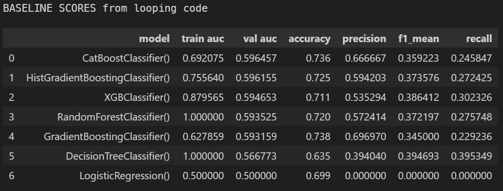
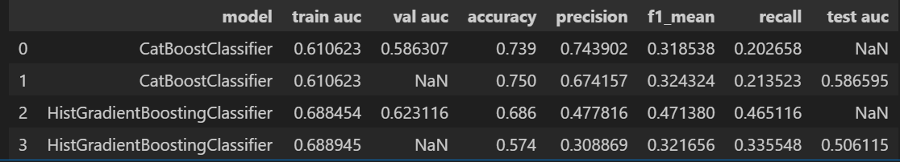
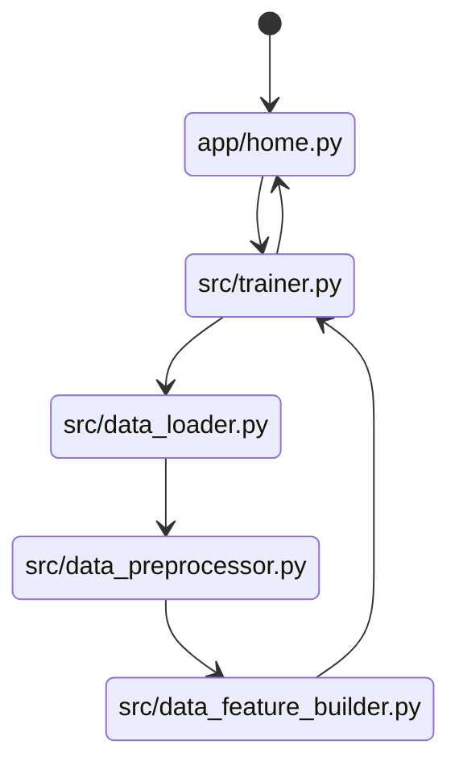

# Students' Graduation Rate Prediction

DataTalksClub's [Machine Learning Zoomcamp](https://github.com/DataTalksClub/machine-learning-zoomcamp/blob/master/projects/README.md) Midterm Project

This repository is the submission for the above-mentioned course's `**Midterm Project**` for the 2023 cohort. This midterm is in between Module 6 Trees and Module 8 Deep Learning. The course has 10 modules approximately, lasting for a duration of 4months.  The course is *free* and run by [@Alexey](https://github.com/alexeygrigorev) together with his team of volunteers.

## Table of Contents
<!-- @import "[TOC]" {cmd="toc" depthFrom=1 depthTo=6 orderedList=false} -->

<!-- code_chunk_output -->

- [Students' Graduation Rate Prediction](#students-graduation-rate-prediction)
  - [Table of Contents](#table-of-contents)
  - [Problem description](#problem-description)
    - [Project Folder Structure](#project-folder-structure)
    - [About this dataset](#about-this-dataset)
    - [Data Dictionary](#data-dictionary)
    - [Domain area research](#domain-area-research)
  - [Installation](#installation)
  - [EDA and Feature Engineering](#eda-and-feature-engineering)
    - [Feature Engineering](#feature-engineering)
    - [Feature Selection](#feature-selection)
  - [Model Selection](#model-selection)
    - [Model training](#model-training)
  - [Reproducibility](#reproducibility)
    - [Exporting notebook to script](#exporting-notebook-to-script)
    - [Containerization](#containerization)
    - [Input](#input)
    - [User Interface](#user-interface)
  - [Lessons Learnt](#lessons-learnt)
    - [Life-cycle of a Machine Learning Model](#life-cycle-of-a-machine-learning-model)
  - [Future Improvements](#future-improvements)
  - [Conclusions](#conclusions)
  - [References](#references)

<!-- /code_chunk_output -->


## Problem description

This project is a Binary Classification problem.

The objective of this project is to predict if a student is on track to graduate within 5 years of commencing college, using the features documented in the [Data Dictionary](#data-dictionary) below. This is a massive concern for institutes of Higher Learning, as it is expensive to both the student *and* the school to drag a 4-year education to longer than 5 years and beyond

The model attempts to identify students who need help early based on their past performance (high_school gpa) with current performance (college_gpa). Some mitigation examples might include extra tutorials or extra credit programmes, and so on. From the macroeconimics perspective, if students are not graduating, means that we are not replenshing an aging population with enough workers fast enough.

It is also meant to identify what features have an impact and which ones have no bearing on a student's performance and the probabilites of them graduating within 5 years.

The selection of this particular problem statement and this dataset is intentional. Keep the data and problem simple and focus on deploying a "completed" midterms according to the [Midterms criteria and scoring rubrik](https://docs.google.com/spreadsheets/d/e/2PACX-1vQCwqAtkjl07MTW-SxWUK9GUvMQ3Pv_fF8UadcuIYLgHa0PlNu9BRWtfLgivI8xSCncQs82HDwGXSm3/pubhtml).

Initially had a multiclass problem with many, many features and thousands of rows. I overestimated my time and skills in scoping & deploying such a project. The Minimum Viable Product of a baseline LogisticRegression pickled model showed too many roadblocks for deploying the web-service and so that dataset was swapped with this one.

This project's files have been organized as follows.

### Project Folder Structure
```bash
.
├── README.md                    -- this file                
├── Dockerfile                   -- file to use for building a Docker image
├── notebook_exploratory.ipynb   -- EDA code
├── notebook_model_tuning.ipynb  -- modeling experiments
├── Pipfile                      -- setup the virtual environment and 
                                    dependency management
├── Pipfile.lock                 -- used by pipenv 
├── /apps                        -- folder for deployment, used by Dockerfile
    ├── home.py                  -- entrypoint of streamlit web-service
    ├── /pages                   -- folder for sites' subpages
        ├── about.py             -- an about me page
        ├── dv.bin               -- the processed and scaled data DictVectorizer
        ├── model.bin            -- the final model used in web app  
        ├── eda.py               -- samples of EDA done
        ├── predict.py           -- the heart of the project
├── /artifacts                   -- folder for images and other artifacts
                                    used in this report and this project
├── /data                        -- houses data file(s)  
├── /src                         -- project's python scripts
    ├── config.py                -- global constants
    ├── clf_catboost.py          -- code to produce catboost.bin
    ├── clf_histboost.py         -- code to produce model.bin 
                                   (output then moved to /app/pages)
    ├── data_loader.py           -- code to read data files
    ├── data_preprocessor.py     -- code to handle preprocessing of data
    ├── data_feature_builder.py  -- code to create new features
    ├── modeler.py               -- code related to models
    ├── predict.py               -- code to test flask app locally
    ├── predict_test.py          -- code to test flask web-service locally

```


### About this dataset


dataset [from @ roycekimmons.com](http://roycekimmons.com/tools/generated_data/graduation_rate)

> This is a fictional dataset and should only be used for data science training purposes.
> 
> This data set includes graduation rates from a four-year college with a variety of student factors.

The key questions we want to address:

> 1. How effective are entrance requirements at predicting gpa and graduation rate?
> 1. What would be the best way to improve graduation rates?

> All data sets are generated on-the-fly. So, you can increase your n by downloading a data set multiple times and combining the files. (n=1000) per large sample download

Based on the above statement, I have downloaded 10x times and combined them into one csv file so that we can work with a larger sample size of 10000 observations, instead of just 1000 observations (in one csv file).

Target is `graduate_in_5years` 

- feature-engineered from 'years_to_graduate' as
  - 0: 'Yes' ie 'years_to_graduate' <= 5
  - 1: 'No' ie 'years_to_graduate' > 5
- was set to 4 years initially until EDA reveals median is 5.


### Data Dictionary

| **Column Name**       | **Description**                               | **Range** | **Data Type** |
|-----------------------|-----------------------------------------------|-----------|---------------|
| 'act_composite_score' | The average of English, Mathematics, Reading, and Science tests. (Numerical) | 1-36 | int |
| 'sat_total_score'     | Sum of Reading & Writing, and Mathematics. (Numerical) | 400 to 2400 | int |
| 'parental_level_of_education' |  For one parent. (Categorical)   | | |
| 'parental_income' | Income for one parent, per annum. (Numerical) | | int |
| 'high_school_gpa' | Grade point average upon graduating high school. (Numerical) | 2.0 to 4.0 | float |
| 'college_gpa' | Grade point average upon graduating college. (Numerical) | 2.0 to 4.0| float |
| 'years_to_graduate' | `target` Number of years to graduate college. (Numerical) | | int  |

The data dictionary describes the purpose of each column and how the column names were converted to have '_' underscores instead of spaces and all in lowercase.

Certain features also have obvious minimum and maximum accepted ranges and they've been used to clip these columns to be within the min-max range as a way to treat the outlier values.

Since gpa and income has such a wide range, the numerical data needs to be scaled as well.

### Domain area research

The SAT and ACT are standardized tests widely used for college admissions in the United States.

**ACT**: The average of a student's scores on the four ACT tests: English, Mathematics, Reading, and Science. The score range for each of the four tests is 1-36. The composite score is reported as a whole number from 1 to 36, and is rounded to the nearest whole number.  

**SAT** : The SAT total score is the sum of the two section scores, Evidence-Based Reading and Writing, and Mathematics. Each section is scored on a scale of 200 to 800, so the total score can range from 400 to 1600 generally, but is different in this fictional school.

**GPA** : answer from google bard to the question 'What is a passing GPA?'

> A passing GPA is the minimum GPA that a student must maintain in order to remain in good standing and graduate from college. The passing GPA varies from school to school, but it is typically between 2.0 and 2.5.
> 
> Some schools may have higher passing GPAs for certain programs or majors. For example, a student in an engineering program may need to maintain a GPA of at least 3.0 in order to graduate.
> 
> Students who fall below the passing GPA may be placed on academic probation. If they do not improve their grades, they may be suspended or expelled from school.
> 
> It is important to note that a passing GPA is not the same as a good GPA. Many colleges and universities use GPAs to determine admissions decisions, scholarships, and honors programs. A student who wants to be competitive in the college admissions process should aim for a GPA of at least 3.0.

## Installation

 

Uses VS Code Extension: `Jupyter PowerToys` for Group tags to run notebook cells in one-click of the mouse, so the tuning can be done separately by classifier-type. Or, just use the .py scripts individually.

You can replicate this repository by

1. Pulling Docker image from [](https://hub.docker.com/r/) <br>or<br>
2. Cloning this repository from github <br>or<br>
3. Using binder  [](https://mybinder.org/v2/gh/ellacharmed/mlzoomcamp-midterms-predict-graduation/submission)


<details>
<summary>1. via Dockerhub</summary>

  - From the terminal, execute the following command to pull the image from Docker hub. It would then auto-launch the container.

    ```bash
    docker run -it -p 9696:9696 graduate_app:latest
    ```
</details>


<details>
<summary>2. via github</summary>

If you decide to clone this repo, you would also need to configure the Dependency and environment management manually. If you prefer not to use `pipenv`, there is also 
1. a `requirements.txt` file that you can use with `pip install`, or
2. a `environment.yml` file that you can use with 
   - `conda env create -n <ENVNAME> --file environment.yml`
   - `micromamba create -n <ENVNAME> -f environment.yml` 
  (*if -n <ENVNAME> is not explicitly specified, it will use "midterms" from the .yml file*)

  - Clone the GIT repository using the Green button, via https or ssh.
    ```bash
    git clone https://github.com/ellacharmed/mlzoomcamp-midterms-predict-graduation
    ```

  - Create virtual environment with your environment manager of choice, and then activate it. A Pipfile is supplied as this project was created using the `pipenv` library.

    ```bash
    pip install pipenv
    pipenv install
    pipenv shell
    ```

- Launch Flask

    Execute command to start the Flask app on localhost for testing locally. Run code below from the root of the project.
    ```bash
    python src/predict.py
    ```

- Build Dockerfile 

    Alternatively, you could also access the app via local Docker Container using the supplied Dockerfile and run as shown. 
    ```bash
    docker build -t <image-name>:<tag> .
    docker tag <image-name>:<tag> <your-username>/<image-name>:1.0
    docker push <your-username>/<image-name>:1.0
    ```
    where
    `docker build -t graduate_app:1.0 .` informs docker to build using the -tag '1.0' for image called 'graduate_app'.

- Run Docker image

  Once the image is built, it will show up in the Docker Desktop app and you can `Run` and spin up a container from there or use the command below from the CLI.

    ```bash
    docker run -d --rm -p 8080:8501 <image-name> --name=<container-name> <username>/<image-name>
    docker run -d --rm -p 8080:8501 graduate_app
    ```
    where
    - `<container-name>` specifies container name of your choice instead of a randomly generated name
    - `<username>` on Docker hub, if image is pushed and published
    - `<image-name>` provided during the build step
    - `8080:8051` default port on local:default streamlit port on docker host
    - `-d` runs in detached mode, ie terminal is free to be used
    - `--rm` container is auto-removed when stopped

</details>


## EDA and Feature Engineering


<details>
<summary>Findings from exploratory data analysis</summary>

This is a summary of some of the core findings from Exploratoray Data Analysis. More detailed analysis can be found in the [*notebook_exploratory.ipynb*](/notebook_exploratory.ipynb) notebook.

**Assumptions about the dataset**:

- data is assumed as a snapshot of just one semester at a time
- not many features on socioeconomics circumstances, or location of college or where the students are from i.e. within the state, or out-of-state, or international students
- in this fictional college of some faraway land, the `sat_total_score` has [min, max] range of [1500, 2400]
- the parental data is assumed to be for just *one* parent
- students are those just finishing high-school and not working adults returning to pursue more education
- when students do not graduate beyond the 5th year, they were not given any ultimatums to "*shape up or else*" and allowed to get to the 10th year
- also not clear if there are students who take longer than 10 years and automatically labeled a "dropout" and thus, didn't earn their undergraduate degrees
- no data on whether students themselves are working part-time, or in multiple part-time jobs or studying full-time. Time spent on studying is a major factor in determining GPA for *most* average students, I would think.

**Findings**:


- the target has slight imbalance but it is not extreme, at least for those in the train set
- more than any other feature, current gpa earned in college is the best indicator of years spent in college to earn that degree
- one's parents' educational achievements, or lack of paper-qualifications has no bearing on one's own measure of finishing college

**Out-of-scope**:

Due to time constrains, some questions raised initially at outset of project was not investigated. These include the following, but is not exhaustive:

- might the data be augmented? as this is a fictional set, possibilities are endless
- if college_gpa has highest feature importance, can modeling be done with just this one feature?
- would the DictVecorizer or OrdinalEncoder be better suited for the feature 'parental_level_of_education'?
- might 'parental_income' being binned and changed as categorical improve model's metrics?

</details>

<details>
<summary>Features Selection & Engineering</summary>

### Feature Engineering

After some consideration, it was decided to convert the target 'years_to_graduate' feature to binary, so that the project's aim is a Binary Classification problem. The full analysis of this feature can be seen in [##analysing_target heading of the exploratory notebook](/notebook_exploratory.ipynb)

<details>target Pie chart
<summary>Expand for images</summary>


</details>

### Feature Selection

From the heatmap via correlation analysis and feature importances attribute, the conclusion was to drop 2 features: 'act_composite_score' & 'high_school_gpa'

<details>Correlation heatmap
<summary>Expand for images</summary>


Feature importances from catboost model, generated by following code-snippet.

```python

best_cat.get_feature_importance(prettified=True)
```


</details>
</details> 

## Model Selection

The selected model is `HistGradientBoostingClassifier` as it has the highest AUC score among all; with the best parameters as provided by `grid_search.best_params_`.

This project uses RandomSearchCV to perform hyperparameter tuning. It is deemed the faster of the 2 hyperparameter tuning methods (ie GridSearch vs RandomSearch, before the Halving ones came along) offered in sklearn library. The way it works is that it looks at the parameter grid and select combinations at random and then fit the model using these params, record the result and then select another random set for the iterations specified (10 in default cases). And then the results are compared among the 10 iterations.

While for GridSearch, all permutations are carried out and thus it takes a while to completely clear the parameter search space. 

[Google Bard's take on RandomSearchCV's concept](https://g.co/bard/share/26b743b45fb8)

If there's a "CV" in its name it is also capable of carrying out Cross Validation. Cross Validation is a method different from `train_test_split` in that it utilizes a RANDOM_SEED value to make its selection on how it partitions the data into blocks called `folds` and then iteratively perform .fit() on each fold and .predict() on the hold-out fold.

[Google Bard's explanation on CrossValidation concept](https://g.co/bard/share/8693f711ad60)

### Model training

The final model.bin uses the following `best_params`, or a slight variation thereof.

```python
best_params = {
  'min_samples_leaf': 2, 
  'max_leaf_nodes': 5, 
  'max_iter': 100, 
  'max_depth': 12, 
  'learning_rate': 0.1, 
  'early_stopping': True, 
  'class_weight': 'balanced'}
best_hist = HistGradientBoostingClassifier(**best_params)
```

<details>
<summary>Expand for images for baseline analysis</summary>

List of classifiers for baseline modeling.


Insights from baseline modeling using defaults parameters:

- the tree-based models are overfitting, looking at the TRAIN scores = 1.0, because in using defaults, the `max_depth` and `early_stopping_rounds` were not specified
- Logistic Regression performs the **worst** out of all listed models
- CatBoost Classifier performs the **best** out of all listed models
- The top 2 models with best validation AUC scores were used to perform hyperparameters tuning with.
- The results of which is shown below.

List of classifiers tuned with RandomSearchCV


</details>

<details>
<summary>Expand for images for Confusion matrix </summary>

Confusion matrix to evaluate which model is finally chosen. 

| HistGradientBoost      | Catboost               |
| ---------------------- | ---------------------- |
|  |  |

Decision is based on which has higher precision, recall and f1 mean i.e. which model can identify higher True Negatives and lower False Negatives and False Positives. Based on this, I decided on HistGradientBoost as it has comparable `precision`, `recall`, and `f1_mean` scores with each other (i.e. these don't deviate too much from each other) while also having the higher validation `auc` score between the two.

I'm pretty sure with more tuning and different parameters, Catboost and other ensemble methods would prove superior. These hypothesis can be tested out as part of [Future Improvements](#future-improvements).

Remember that,

- Precision and Recall has a push-pull relationship with each other, when one goes higher, the other would become lower and vice versa.
- Precision: measures the proportion of positive predictions that are actually correct. $$Precision = TP / (TP + FP)$$
- Recall: measures the proportion of actual positives that are correctly identified. $$Recall = TP / (TP + FN)$$
- F1_mean score: is a metric that combines precision and recall into a single number. $$f1_mean = 2 * (precision * recall) / (precision + recall)$$

</details>

## Reproducibility

This Project uses Docker and Streamlit for deployment. Code from notebook was transferred to modules and that means learning OOP, which suprisingly means learning about Paths among other things. Always a gotcha on this one as we have different conventions on Windows and MacOS/Linux regarding `"/"` and `"\"`. Using containers alleviate this confusion, but still need to figure out when your main development machine is on Windows.

### Exporting notebook to script

Any time a block of code is being repeated or use elsewhere or when reloading notebook, it is transferred to python script files. And for this project, end up with these 4 .py modules and a global config.py containg the Global CONSTANTs used throughout:

```python
from config import * 
from src.data_loader import CSVDataLoader
from src.data_preprocessor import Preprocessor
from src.data_feature_builder import FeatureBuilder
from src.modeler import Trainer
```

With the command `streamlit run app/home.py` triggered when we launch docker with `docker run -d --rm -p 8080:8501 graduate_app` and since the Dockerfile has a line `WORKDIR /app`, the flow of the program control from when the `/app/pages/model.bin` is loaded, goes like this:



### Containerization

This project uses Docker which can be build as follows. And then run it locally by going to `http://localhost:8080/predict`.

```python
docker build -t ellacharmed/midterms_graduate_app:latest .
docker run -d --rm -p 8080:8501 ellacharmed/midterms_graduate_app:latest
```

### Input

Using Streamlit, it is easier to ensure that input data is consistent with what the DictVectorizer is expecting. It is very user friendly as compared to a Flask app where we need to code the html and css pages as templates.

### User Interface


## Lessons Learnt

Working on an End-to-end Machine Learning project with the aim to deploy it taught me a lot of things, mainly what gaps still exists in my skillset more than anything else. And how much there is to think about! Just look at the choices we need to decide on during the life-cycle of this project. First and foremost being what sort of problem do we want to tackle?

As the main aim is to learn deployment, my criteria for a dataset is :

- simple, not have too many features
- straightforward problem statement: **'Prediction of Graduating in 5 Years**
- not requiring too much pre-processing and feature-engineering

As it is, I hit a roadblock on using Pipelines and had to revert back to trusty ole DictVectorizer from lessons.

The other factor is in not realizing how our features rely on CSS and other web-framework's UI/UX methodologies to receive inputs and validate said input. I would put greater emphasis on this in capstone first, ahead of hyperparameter tuning so I don't have to reiterate too much and become the hudle, like in this midterms.

### Life-cycle of a Machine Learning Model

So many choices, need to ensure *`analysis paralysis`* don't set in. Choose simplest and fastest to learn has been my criteria for decision making. So it pretty much rely on which has the better documentation.

- Choice of dataset and problem statement
- Choice of data columns to use in training model
- Choice of cleaning and processing strategies of missing/dirty/incomplete data
- Choice of model
- Choice of metrics
- Choice of web framework eg: Flask, FAstAPI, Streamlit, PythonAnywhere, and more
- Choice of web server on the cloud eg: AWS, GCP or Azure
- Cost of libraries in terms of skills and experience of team involved
- (out-of-scope this round) Choice of apps/tools for continuous delivery and monitoring of model performance after deployment
- Cost considerations of all the above i.e. : is open source available?

## Future Improvements

Areas to cover for next capstone. Make sure to improve on these areas, at the very least, while learning modules08-10.

1. Configure and incorporate Unit Testing, instead of using print() and logging() to debug code.
2. Experiment with other libraries for imbalanced dataset like SMOTE, and other techniques. Might this be the cause of [this issue](https://x.com/ellacharm3d/status/1722183002967663043?s=20)?
3. Fix all the plotting code(s).
4. Tidy up config.py and use dotenv or similar.
5. Tidy up the scripts further using OOP principles.
6. Tidy up documentation and docstrings and comments - check for outdated and wrong/mismatched comments.
7. Utilize Pipelines and investigate how to overcome the problem faced in [tweet on Pipeline issue](https://x.com/ellacharm3d/status/1720461928399827239?s=20).
8. Unify plots' colour scheme with website for "branding" presentation, regardless if using plotly, matplotlib or seaborn. Does a cmap exist that is present in all 3 plotting libraries?
9. Deeper dive in xgboost, catboost and lightgbm as they have built-in features not found in sklearn's estimators. For example, catboost has its own randomized_search() method that has a nifty plotting feature. (*unless as I've felt the rnd_search code for clf_histboost.py is convoluted and make execution unnecesarily over-complicated and longer than necessary*).
10. Is using auto-ml libraries a boon or a hindrance for learning? eg `pandas_profiling`, `lazypredict`, `pycaret`, etc. It makes things faster, but everything is behind a "black box" of *how did they do that?* So, it is not great for explainability for project documentation purposes. Not to mention the heavy reliance on 3rd-party libraries. Some of them uses very outdated versions of pandas and sklearn.
11. Solution Delivery. Excited to use Saturn Cloud for this, also need to learn CI/CD and that means Github Actions.


## Conclusions

For sure, more practice is needed using a wide range of datasets and for various problem statements. Only from this variety would experience be gained and speed up each section of the life-cycle. 

In terms of the problem statement for this particular repo, more experimentation to see if model can be improved at the very least. And to test that hypothesis of using just one feature - the `'college_gpa'`. As AUC on test data is pretty low, also experiment with other parameters. And to have a better handle on this, I'd need to learn MLOps, as well.

Hit an issue that the prediction does not seem to be able to predict the minority class due to the imbalance data, so more experimentation and troubleshooting to the course of this as well.

## References

Here are some of my favourite references in learning Data Science and Machine Learning, that I keep returning to over and over in the course of my studies.

- Documentations from the various python packages.
- On imbalanced datasets:
  - [A Gentle Introduction to Imbalanced Classification](https://machinelearningmastery.com/what-is-imbalanced-classification/)
- On hyperparameter tunings (and others):
  - [Inria's Machine learning in Python with scikit-learn MOOC](https://inria.github.io/scikit-learn-mooc/tuning/parameter_tuning_module_intro.html)
- On Documentation How-TOs and best practices:
  - simplified project structure based off of [Cookiecutter Data Science](https://drivendata.github.io/cookiecutter-data-science/)
  - [The Turing Way: A handbook for reproducible, ethical and collaborative research](https://the-turing-way.netlify.app/index.html)
  - [The Turing Way "Zero to Binder"](https://the-turing-way.netlify.app/communication/binder/zero-to-binder.html)
  - [AI Practitioner Handbook by AISG](https://connect.aisingapore.org/2023/03/introducing-the-ai-practitioner-handbook-a-comprehensive-guide-to-delivering-ai-projects-straight-from-ai-singapores-engineers/)
- On Machine Learning:
  - [The AIAP™ Field Guide (Version 4.0)](https://connect.aisingapore.org/aiap-field-guide/)
  - [The Open Source Data Science Masters](https://datasciencemasters.org/)
